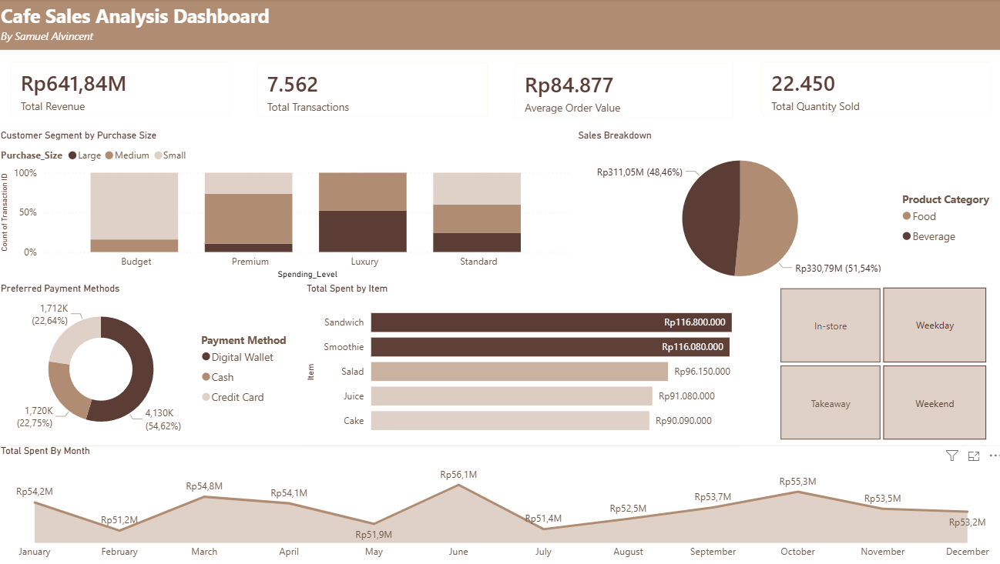

# Cafe Sales Data Cleaning & Customer Segmentation Analysis
This repository contains an end-to-end Data Understanding, Quality Assessment, and Data Cleaning project for a café sales dataset. The dataset initially contained significant noise, inconsistent types, and missing values that hindered accurate analysis. After a comprehensive data wrangling process, the clean data was segmented to provide actionable business recommendations.

# Interactive Dashboard Preview

---

## 1. Data Understanding & Quality Assessment
During the initial assessment, several critical data quality issues were identified across the dataset variables:

**Identified Data Issues:**
- Structural Inconsistencies: The Transaction Date column was loaded as an object/string instead of a standard datetime format.

- Corrupted & Noise Data: Columns like Quantity contained invalid text values such as 'UNKNOWN' and 'ERROR'.

- Missing Values: High percentages of missing data were found in strategic categorical columns:

    - Payment Method: 25.79% missing values.

    - Location: 32.65% missing values.

- Data Duplication: Presence of duplicated rows that skew transaction volumes.

## 2. Data Cleaning & Wrangling Pipeline
To ensure integrity for further analysis, the following data cleaning workflow was implemented:

 - Handling Missing Values & Noise:

     - Converted invalid strings ('UNKNOWN', 'ERROR') into standard NaN using pd.to_numeric with errors='coerce'.

     - Dropped completely redundant or highly corrupted rows where critical identifiers were missing.

- Type Conversion:

     - Casted Transaction Date into proper datetime64 format.

     - Standardized Quantity and other numerical parameters back into optimized integer/float formats.
 
- Feature Engineering & Calculations:
     - Recalculated missing or inconsistent Total Spent entries systematically by applying the formula:
        - Total Spent = Quantity X Price Per Unit

- Deduplication :
     - Filtered out all identical duplicate entries to retain unique transactional records.
 

## 3. Key Insights & Customer Segmentation
After refining the data quality, a descriptive analysis was conducted to understand customer purchasing behaviors:
- Basket Size Distribution: The transaction analysis revealed that 81.15% of the transactions fall under Small and Medium Baskets (purchasing 1-2 items), while 18.84% represent Large Baskets.
- Value-Based Segmentation: Clear operational distinctions were found between the Budget Segment (highly responsive to volume promotions) and the Premium Segment (yielding higher profit margins per transaction)

## 4. Strategic Business Recommendations
Based on the finalized data patterns, the project proposes three main strategies for the café management:

- Differentiated Marketing Strategy:

     - Budget Segment: Implement "value for money" campaigns, bundle promotions, or "buy 2 get more discount" models to sustain high transactional velocity.

     - Premium Segment: Focus on exclusivity, higher service metrics, and premium seasonal/limited-edition menus to maximize profit margins.

- Operational Adjustments for Checkout:

     - Establish Fast Checkout Lanes dedicated to small basket sizes (1-2 items) to rapidly increase table turnover rates during peak hours.

- Basket Size Upselling:

     - Introduce attractive Family Packs or bundle incentives for purchases above 5 items to systematically migrate medium basket buyers into large volume buyers.

